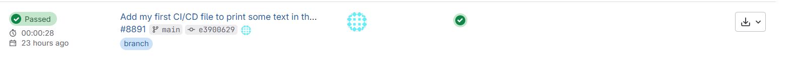
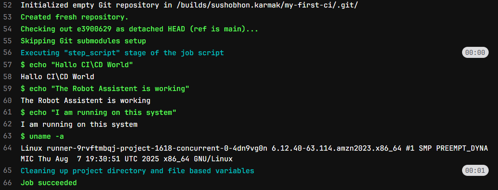

# What is CI/CD?
**CI/CD** stands for **Continuous Integration** and **Continuous Delivery** (or **Continuous Deployment**).

At its heart, it's a practice to automate the 'boring' and 'risky' part of automating testing of a package or code or software.

- **Continuous Integration (CI):** This is the **automated quality checks**. It is a robot assistant that, *every single time* a developer push a new code, it runs the code in a clean test environment and check if the code or application is running fine or not. 
    - **The Goal** is to find bugs *fast*, right when they have created, before they mixed in with other people's work.

- **Continuous Delivery (CD):** This is the **automated release process**. If the code passes all the CI tests, the robot assistant *automatically* takes the finished product and package it up.
    - There's also **Continuous Deployment**, which is when the robot also does the final step of shipping it to customers automatically. A little scarier, but very powerful!

# Why it is Important for Data Scientists?
You might think, "I'm not a web developer, I just write scripts and Jupyter notebooks. Why do I need this?"

In many ways, CI/CD is *even more important* for data science because our work has two "moving parts": **the code *and* the data**. Both can break. CI/CD acts as your personal lab assistant and data bodyguard.

Here are some real-life usecases of CI/CD pipeline.

**1. It Solves the "It Works On My Machine!" Nightmare:**

- **Example:** You build a fantastic model using `pandas 2.1` on your new laptop. You email your `script.py` to a colleague. Their laptop has `pandas 1.5`, and the script crashes horribly. You both waste an entire afternoon on a video call debugging "environment issues."

- **The CI/CD fix:** This is exactly what we fixed. By using `image: python:3.10` or `image: ubuntu:22.04` in our `.gitlab-ci.yml`, we force our code to run in a **brand new, perfectly clean, 100% reproducible environment every time**. If it passes in the pipeline, it's guaranteed to be solid. No more "works on my machine" excuses!

**2. It Guarantees Your Model and Data are Valid:**

- **Example:** You have a model that predicts house prices. A new person on your team "helps" by cleaning up the training script. They accidentally drop the `square_footage` column from the input data. The script *runs* without an error, but the model it produces is now garbage. You don't find out until your boss's weekly report is full of insane predictions.

- **The CI/CD Fix:** This can be prevented by running some test cases every time some changes happens in the code.  The moment that bad code is pushed, the test cases fails. The pipeline turns red. The bad model never gets saved, and you get an email instantly. You've protected your project's integrity.

**3. It Automates Your Tedious, Repetitive Work:**

- **Example:** Every Monday at 9 AM, you have to manually open your Jupyter notebook, click "Run All", wait 20 minutes for it to re-train on the new weekly data, save the output `summary_report.csv`, and then email it to your manager. It's boring, and one day you're on vacation and it doesn't get done.

- **The CI/CD Fix:** GitLab (and other tools) allow for **Scheduled Pipelines**. You can set your `train_model_job` to run automatically *every Monday at 9 AM*. It will run, create the `validation_report.csv` as an artifact, and you can even add a final `deploy` job to automatically email it or upload it to a server. You've automated your job, and you can enjoy your vacation.

# Building Simple CI/CD Pipeline:
Let's see how we can build a simple CI/CD Pipeline in gitlab (You can also build it in github). 

1. First you have to create a *gitlab* account. Go to [https://gitlab.com/](https://gitlab.com/) and signup.

2. Once account setup is complete create a **New Project**, name it `my-first-ci` or something fun.

3. Create a **New File** and name it `.gitlab-ci.yml`. The name of the file should be exactly this else it will not work in gitlab. (For GitHub the name of the file should be inside `.github/workflows/`. The file can have any name but it has to a `.yml` file)

4. Place below text in `.gitlab-ci.yml` and commit.
```{bash}
# This is our first CI/CD 'recipe' in YML format.
# This someting like a simple shopping list.

# Here we are defining a job for the robot to do.
# We can call it anything we want. Let's say the job as 'say_hello'

say_hello:
    # Scripts are the most important part.
    # It is the list of commands that the robot must run.
    script:
        - echo "Hallo CI\CD World"      # echo is the command of printing text.
        - echo "The Robot Assistant is working"
        - echo "I am running on this system"
        - uname -a # uname -a is the command that prints system info.

```
We will see what the above script do later. For now commit the changes in `main` branch.

5. Go to **Build** > **Pipelines**. You should see your new pipeline. It will have a status like "pending," "running," or "passed." Click on it. 


6. You will see a graph with our job name. In this case the name is `say_hello`. Click on it.

7. You are now watching *Job log*. You can see all the commands executed successfully and their output is showing here.


What ctually happened here. Let's Try to understand the content of the `.gitlab-ci.yml` file first. The `.gitlab-ci.yml` file contains a list of task (or job) to perform. In our case we have only one job `say_hello`. For each job we will execute some command, those commands are listed in the `script` section in sequential order. In our case the job prints some texts. You can verify this in the above screenshot.

***Yeh! We have build our first CI/CD pipeline.***