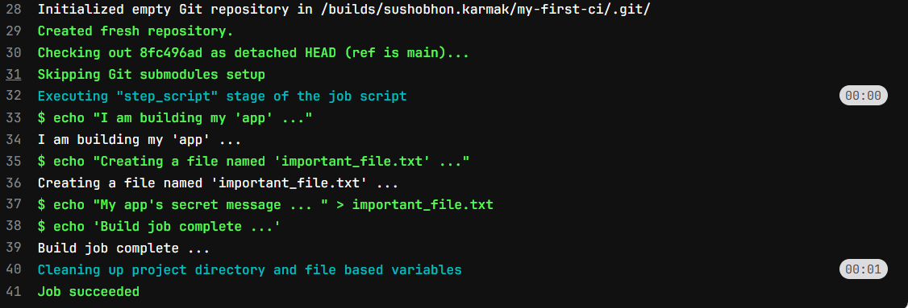
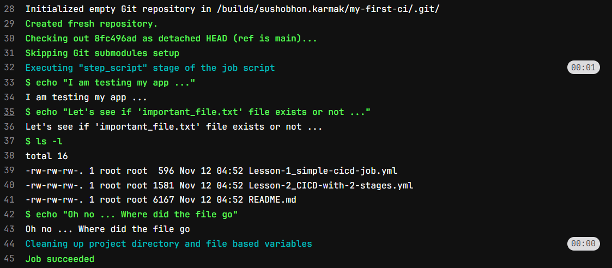
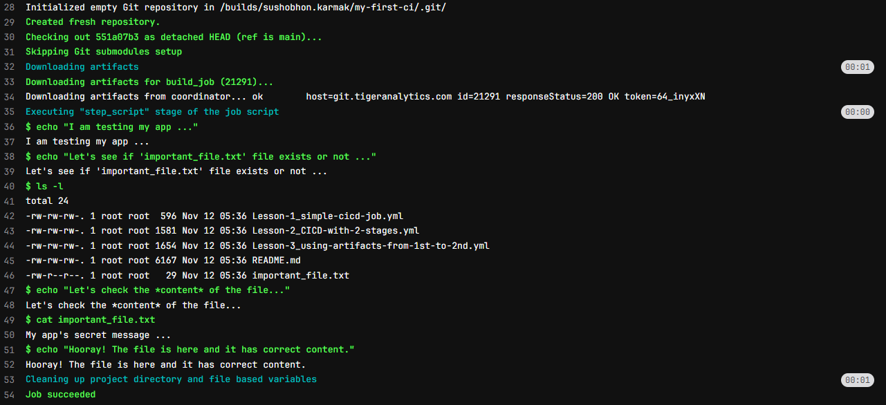

# Introduction
In [***Part 1***](../2025-11-10-CICD-Pipeline-for-Beginners-1/index.qmd) we have build a simple **CI/CD pipeline** in gitlab. That pipeline had one job. Now, it's time to move ahead and try running multiple jobs. Imagine a process where we need to run a script that will build an artifacts or generate a file in the first job. Then we will check the artifact or see whether the file generated correctly or not. In this case we have two jobs:

1. **Build:** Building or Generating the file.
2. **Test:** Analyzing the file.

Note that, these jobs have to be in sequence. Once first job is completed then only the 2nd job can start.

Let's try to build the pipeline.

# Pipeline with Two Sequential Job 

Update the `.gitlab-ci.yml` file with below code:
```yaml
# We first define the order of our stages.
# 'build' will ALWAYS run before 'test'.
stages:
  - build
  - test

# --- This is our first job ---
build_job:
  stage: build  # We assign this job to the 'build' stage
  script:
    - echo "I am 'building' my app..."
    - echo "Creating a file named important_file.txt"
    # Instead of printing the message we are writing the message in the 'important_file.txt' file
    - echo "My app's secret message" > important_file.txt 
    - echo "Build complete."

# --- This is our second job ---
test_job:
  stage: test   # We assign this job to the 'test' stage
  script:
    - echo "I am 'testing' my app..."
    - echo "Let's see if the file 'important_file.txt' exists..."
    - ls -l   # This command lists all files
    - echo "Oh no ... Where did the file go"
```

Let's understand the `.yml` file -
First, we define stages `build` and `test`. The stages will run sequentially, first `build` stage is executed then `test` stage. 

Then, we define two jobs `build_job` and `test_job`. We want to run `build_job` first, so we tagged `build` stage with `build_job`. The `echo` commands in first two line will print the text in the console, In third line we are writting the text in `important_file.txt`. This file was not there before, we are generating the file.

In second job we tagged `test` stage, which will start executing once `build` stage is complete. The second job is simple. We are looking in the directory if the `important_file.txt` file is present or not.

Now, let's commit the changes and check the pipeline.


`build_job` run successfully.

Let's take a look at `test_job` log.


*Wait! What? There is not file called `important_file.txt` in the directory.* 

**Why this is happening?**

This is happening because for each job *gitlab runner* assigns a new machine. When first job is completed the machine removes all files. We can see `Cleaning up project directory and file based variables` message. That means one job 1 is completed 'important_file.txt' file also got deleted. So, in job 2 we did not see that file.

**Then the next question is how can we stop the file from getting deleted?**

# Passing File from One Job to Next Job

To pass the required files to the next job we need specifically mention to save the files for the next job. In GitLab CI, these saved files are called **artifacts**. 

**Let's fix out** `.gitlab-ci.yml`

```yaml
stages:
  - build
  - test

# --- This is our first job ---
build_job:
  stage: build
  script:
    - echo "I am 'building' my app..."
    - echo "Creating a file named important_file.txt"
    - echo "My app's secret message" > important_file.txt
    - echo "Build complete."
  artifacts:          # <-- THIS IS THE NEW, MAGIC PART!
    paths:            # We give it a list of files/folders to save
      - important_file.txt

# --- This is our second job ---
test_job:
  stage: test
  script:
    - echo "I am 'testing' my app..."
    - echo "Let's see if the file 'important_file.txt' exists..."
    - ls -l
    - echo "Let's check the *content* of the file..."
    - cat important_file.txt # 'cat' is a command to print a file's content
    - echo "Hooray! The file is here and it has the right message!"
```

This time as we can see we have added a new section called `artifacts` under `build_job`.  Here we pass a list of files or folder to save.  In the path section we specifically mentioned to save `important_file.txt`. Now commit the changes and see the job logs.

We can see the `build_job` run successfully and created the file `important_file.txt`.


What about `test_job`. Let's see the log file.


Now we can see that `important_file.txt` is present in the directory. We have successfully passed files from one job to the next job.

In [***next part***](../2025-11-26-CICD-pipeline-for-Beginners-3/index.qmd) we will see how we can run python code using CICD pipeline.