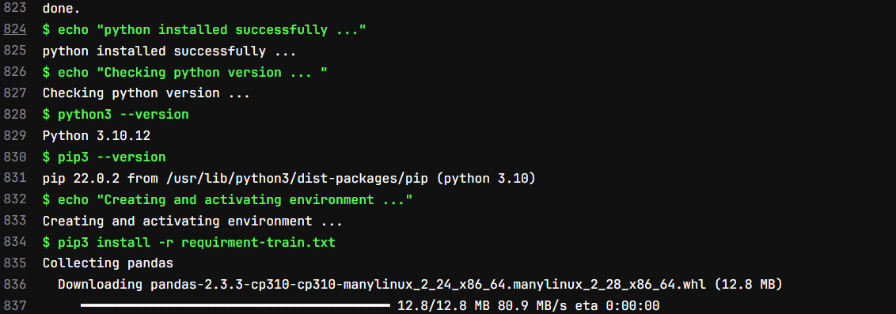
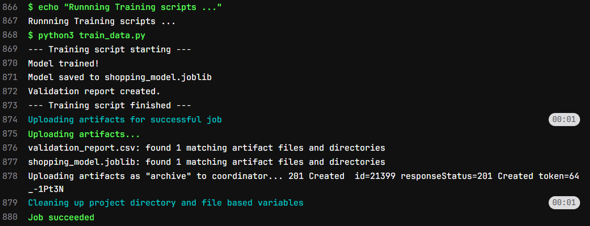
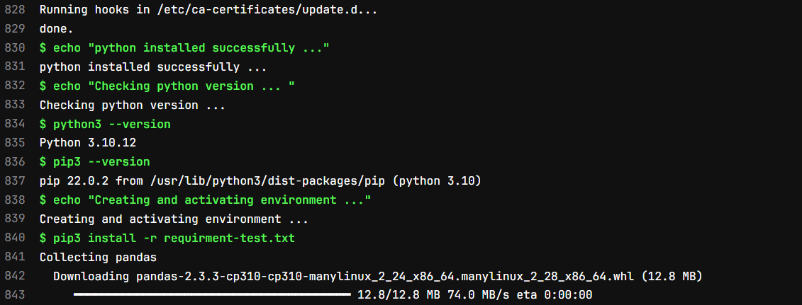
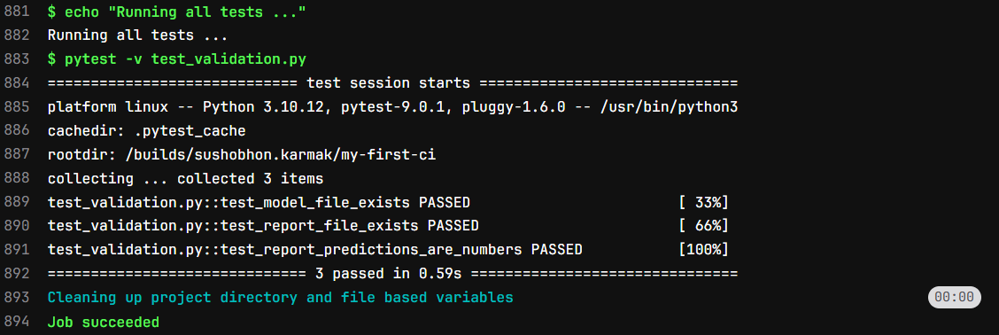

# Introduction

In [***Part 2***](../2025-11-12-CICD-pipeline-for-Beginners-2/index.qmd) we have seen how we can run multiple jobs in one pipeline. We have also seen how we can ensure that the jobs runs in a specific order and artifacts or files generated in one job can be passed to other.

In **Part 3** we will be see how we can run python code. As of now we have run all the code or command in bash shell, but as a data scientist we need to know how we can run python script as well.

Here we -

- Download an empty Ubuntu docker image first
- Install python
- Install the packages
- Run python code to build a simple model
- Run some test cases to validate

Note that, these jobs also need to be in sequence. So, we will have similar approach as *Part 2*. Let's build the pipeline.

# Pipeline to Run Python code:

We can devide this jobs into mainly 3 groups - 

1. Environment Setup (Downloading Ubuntu, Installing Python)
2. Training Job (Installing required packages for training and train the model)
3. Testing Job (Install required packages for testing and test the model)

## Create Python Files and requirment files:

So, First we need train code, let's call it `train_data.py`, a simple python code.
```python
import pandas as pd
from sklearn.linear_model import LinearRegression
import joblib

print("--- Training script starting ---")

# 1. Create simple training data
X_train = pd.DataFrame({'age': [20, 25, 30, 35, 40]})
y_train = pd.Series([200, 250, 300, 350, 400]) # e.g., shopping $

# 2. Train a 'complex' model (it's not complex, don't tell)
model = LinearRegression()
model.fit(X_train, y_train)

print("Model trained!")

# 3. Save the model
joblib.dump(model, 'shopping_model.joblib')
print("Model saved to shopping_model.joblib")

# 4. Create a test report for validation
X_test = pd.DataFrame({'age': [22, 33]})
predictions = model.predict(X_test)

report = pd.DataFrame({'age': [22, 33], 'predicted_spend': predictions})
report.to_csv('validation_report.csv', index=False)

print("Validation report created.")
print("--- Training script finished ---")
```
This code is simple. We are creating a dummy data and training a simple Linear Regression Model on top of it. Then save the model objects. We predict for few cases using the model and saving the output into a csv file.

Now let's create a Test Script called `test_validation.py`.
```python
import pandas as pd
import os

def test_model_file_exists():
    """Test 1: Check if the model file was passed."""
    print("Running test: Checking for model.joblib...")
    assert os.path.exists('shopping_model.joblib')
    print("...PASS: Model file exists.")

def test_report_file_exists():
    """Test 2: Check if the report CSV was passed."""
    print("Running test: Checking for validation_report.csv...")
    assert os.path.exists('validation_report.csv')
    print("...PASS: Report file exists.")

def test_report_predictions_are_numbers():
    """Test 3: Check the data in the report."""
    print("Running test: Validating report data...")
    df = pd.read_csv('validation_report.csv')

    # A simple check to make sure predictions are not crazy
    assert 'predicted_spend' in df.columns
    assert df['predicted_spend'].dtype == 'float64'
    assert df['predicted_spend'].isnull().sum() == 0
    print("...PASS: Report data looks valid.")
```

Here we are doing some sanity check like whether the files are present or not.

Now since we have both the python code we have to create requirment.txt file with all the packages. For Training and testing purpose we might need different packages so we will create 2 requirment file -

- `requirment-train.txt` with packages for training job and
- `requirment-test.txt` with packages for testing job

Let's create these 2 files as well. Create `requirment-training.txt` and add:
```
pandas
scikit-learn
joblib
```
Then create `requirment-test.txt` and add:
```
pandas
pytest
```
*(Here I have added few packages for illastration purpose. Not all packages are necessary.)*

## Building Pipeline to Run Python Code:
Let's create `.gitlab-ci.yml`:
```yaml 
# Downloading the ubuntu image 22.04 image
image: ubuntu:22.04

# 'before_script' commands under this process will run before scripts command.
before_script:
  - echo "Upgrading ubuntu image and then installing python ..."
  - apt-get update -y   # This command will update ubuntu image
  - apt-get install -y python3.10 python3-pip # Install python and pip
  - echo "python installed successfully ..."
  - echo "Checking python version ... "
  - python3 --version
  - pip3 --version

# Defining stages
stages:
  - train
  - test

# --- Job 1: Training the Data in a virtual environment --- #
training_job:
  stage: train
  script:
    - echo "Creating and activating environment ..."
    - pip3 install -r requirment-train.txt  # Installing all the libraries for training
    - echo "Runnning Training scripts ..."
    - python3 train_data.py

  artifacts:
    paths:
      - validation_report.csv   # Validation report saving
      - shopping_model.joblib   # Saving Model Object


# --- Job 2: Validating Result --- #
testing_job:
  stage: test
  script:
    - echo "Creating and activating environment ..."
    - pip3 install -r requirment-test.txt
    - echo "Running all tests ..."
    - pytest -v test_validation.py

```

First we download an ubuntu image from docker using `image: ubuntu:22.04`. This is a simple ubuntu desktop.

Now we have 3 main section. (1) before_script, (2) training_job and (3) test_job. 

*Wait! What is `before_script` section? This hasn't appeared before.*

Yes this is a new section of command. Under this section all the commands will be executed before commands in first job section. This is perfect for setting up environments.

In our case inside `before_script` section we are installing python and checking version of python and pip using below command.
```yaml
  - apt-get update -y   # This command will update ubuntu image
  - apt-get install -y python3.10 python3-pip # Install python and pip
  - echo "python installed successfully ..."
  - echo "Checking python version ... "
  - python3 --version
  - pip3 --version
```
The output of this stage will look like below


Then we are defining our stage names as `train` and `test`. In `train` section first we install all the required packages, then run `train_data.py` using below command:
```yaml
    - pip3 install -r requirment-train.txt  # Installing all the libraries for training
    - echo "Runnning Training scripts ..."
    - python3 train_data.py
```
Once `train_data.py` execute we will upload the artifacts and close the job. After that `test` stage will start. 

The output of the `train` stage will look like below:
 

In `test` stage first we will install all the required packages from `requirment-test.txt` file, then execute `test_validation.py` file.
```yaml
    - pip3 install -r requirment-test.txt
    - echo "Running all tests ..."
    - pytest -v test_validation.py
```
The log of `test` stage will be like this



*Congratulation!!!*

If you have come this far then you know how to run python or any other code in CICD pipeline.